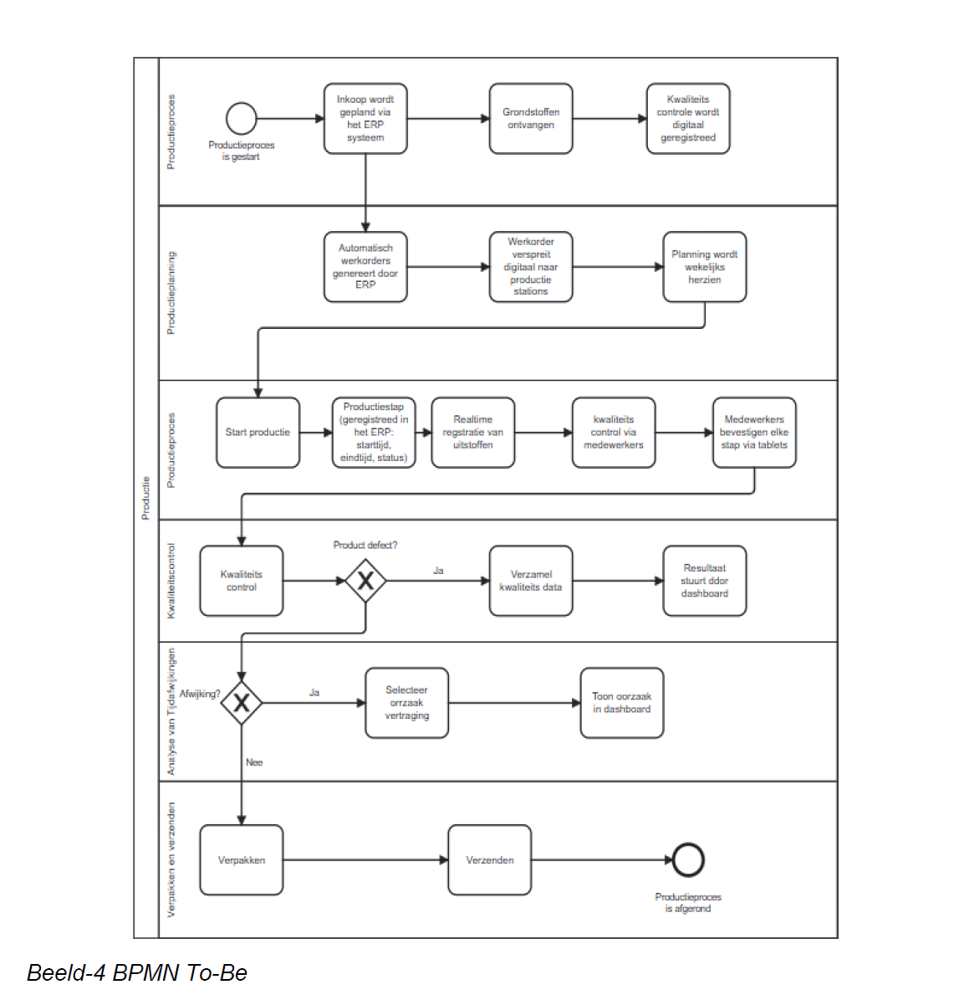
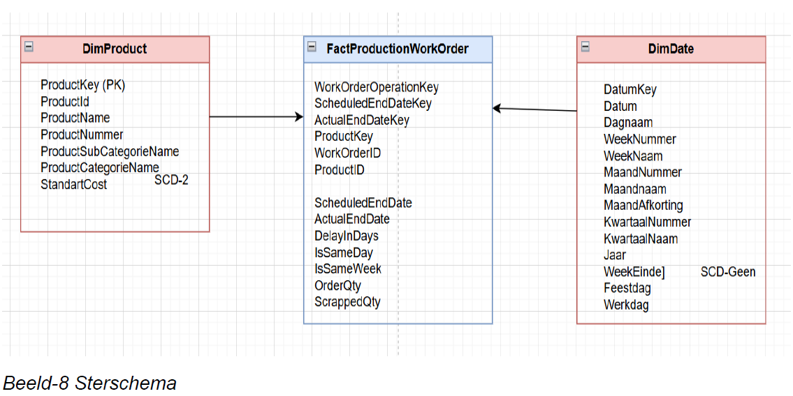
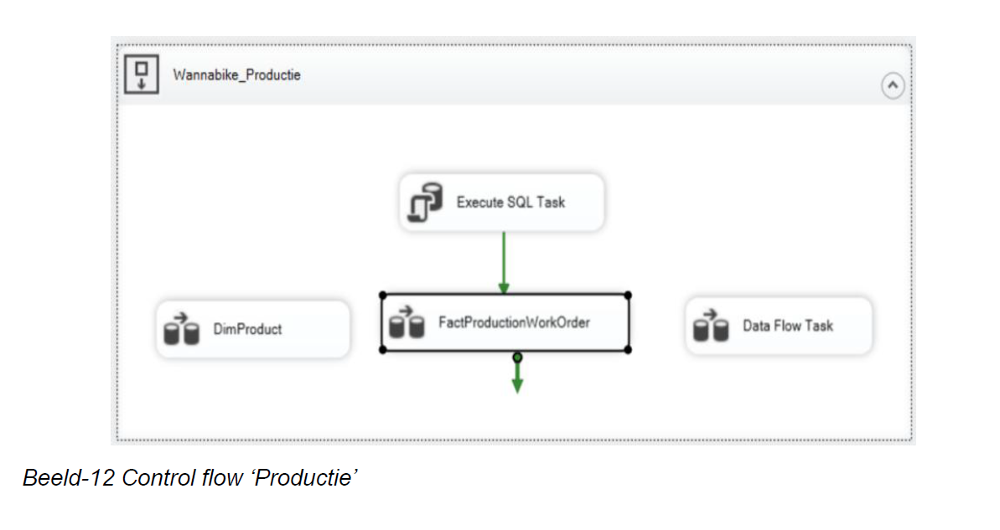
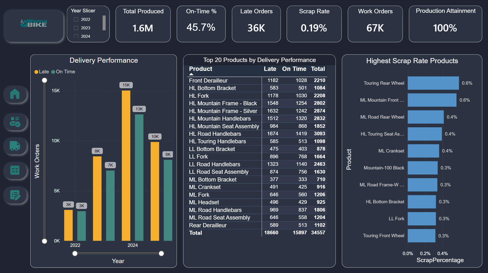

# WannaBike – End-to-End Business & Data Analytics Project

An end-to-end **Business Intelligence and Data Analytics project** covering business process analysis, information analysis, dimensional modeling, ETL/data warehousing and Power BI dashboard development.

The project was developed as part of the **Business & Data Analytics** program at the Amsterdam University of Applied Sciences (Hogeschool van Amsterdam).

The case focuses on the production process of the fictional company **WannaBike** and demonstrates how business problems can be translated into data requirements, data models and actionable BI insights.

## Project Goal

WannaBike's management lacked reliable and standardized insight into production performance.

The main challenges included:

* Production delays
* Limited visibility into planned versus actual production
* Scrap and material waste
* Inconsistent quality control
* Fragmented operational processes
* Lack of structured KPI monitoring

The objective of the project was to analyze these issues and develop a data-driven solution that supports production management and decision-making.

## End-to-End Approach

The project follows the complete analytical process:

```text
Business Problem
      |
      v
Business Process Analysis
      |
      v
Information Requirements
      |
      v
KPI & User Story Definition
      |
      v
Conceptual Data Model
      |
      v
Dimensional Modeling
      |
      v
ETL & Data Warehouse
      |
      v
Semantic Model
      |
      v
Power BI Dashboard
      |
      v
Business Insights
```

## 1. Business Process Analysis

The existing production process was analyzed to identify operational bottlenecks, risks and waste.

Methods used include:

* BPMN – AS-IS process modeling
* Ishikawa / Fishbone analysis
* FMEA – Failure Mode and Effects Analysis
* Muda – 7 + 1 wastes
* Lean process improvement
* TO-BE process design

The analysis identified issues such as missing intermediate quality controls, ad-hoc planning, duplicate paper/digital work orders, insufficient KPI monitoring and material-related production delays.

## 2. Information Analysis

Business requirements were translated into measurable information needs.

The analysis included:

* KPI and PPI definition
* User stories
* Information requirements
* Conceptual ERD
* Use cases
* Dashboard concepts

Example business questions included:

* Are planned and actual production completion dates within the same week?
* Which work orders are delayed?
* Which work orders exceed the scrap threshold?
* How does production volume develop over time?
* Which products or production areas contribute most to inefficiency?

## 3. Key Performance Indicators

Important KPIs and PPIs include:

### Production Lead Time

Measures the difference between planned and actual production timing.

```text
Production Lead Time =
Actual End Date - Scheduled Start Date
```

### Scrap Percentage

Measures production waste per work order.

```text
Scrap % =
Scrapped Quantity / Order Quantity × 100
```

The target is to keep the scrap percentage below **2% per work order**.

### Production Volume

Tracks completed production and work orders across:

* Year
* Quarter
* Month
* Product
* Product category

## 4. Dimensional Modeling

A dimensional data model was designed to support analytical reporting.

The model follows a **star-schema approach**, separating measurable production events from descriptive dimensions.

Main analytical areas include:

* Work orders
* Products
* Dates
* Production quantities
* Scheduled and actual production dates
* Scrap quantities
* Production performance

This model provides the foundation for the Power BI semantic layer.

## 5. Data Warehouse & ETL

The data warehouse was built using Microsoft SQL Server technologies.

The ETL process includes:

```text
Source Data
     |
     v
Staging Area
     |
     v
Data Cleaning & Transformation
     |
     v
Dimension Tables
     |
     v
Fact Table
     |
     v
Data Warehouse
     |
     v
Power BI
```

ETL development was performed with **SQL Server Integration Services (SSIS)**.

Techniques used include:

* Lookup
* Merge Join
* Derived Column
* Data Conversion
* Slowly Changing Dimensions
* Data Flow Tasks
* Control Flow
* Fact and dimension loading
* Data quality and transformation logic

## 6. Business Intelligence & Power BI

The final analytical layer was developed in **Power BI**.

The dashboard provides management with insight into production performance, quality and delivery.

Dashboard areas include:

* Production overview
* Delivery performance
* Product performance
* Quality
* Work-order analysis

The Power BI model uses a structured semantic model and DAX measures to transform warehouse data into business KPIs.

## Power BI Dashboard

The included `.pbix` file contains the interactive Power BI solution:

`Product Performance Dashboard v3.pbix`

The dashboard allows users to analyze production performance from different perspectives and drill into operational issues.

## Business Value

The solution demonstrates how fragmented operational data can be transformed into structured management information.

It enables decision-makers to:

* Detect production delays
* Monitor scrap and quality issues
* Compare planned versus actual performance
* Identify problematic products and work orders
* Track production trends over time
* Support continuous process improvement
* Move toward data-driven decision-making

## Technologies & Methods

### Data & BI

* Power BI
* DAX
* Power Query
* SQL Server
* SSIS
* ETL
* Data Warehousing
* Dimensional Modeling
* Star Schema
* Semantic Modeling

### Business Analysis

* BPMN
* Information Analysis
* User Stories
* Use Cases
* ERD
* KPI / PPI design

### Process Improvement

* Lean
* Ishikawa
* FMEA
* Muda
* AS-IS / TO-BE analysis

## Repository Contents

```text
wannabike-end-to-end-bi-project/
│
├── README.md
├── Project-Wannabike.pdf
├── Product Performance Dashboard v3.pbix
│
└── screenshots/
    ├── business-process.png
    ├── star-schema.png
    ├── etl-ssis.png
    └── power-bi-dashboard.png
```

## Project Report

The complete project report is available in:

`Project-Wannabike.pdf`

It documents the complete journey from business process analysis and information requirements to data warehousing and Business Intelligence.

## Screenshots

### Business Process Analysis



### Dimensional Model



### ETL with SSIS



### Power BI Dashboard



## Project Status

Completed portfolio project demonstrating an end-to-end Business & Data Analytics workflow from business problem analysis to an interactive Power BI solution.


